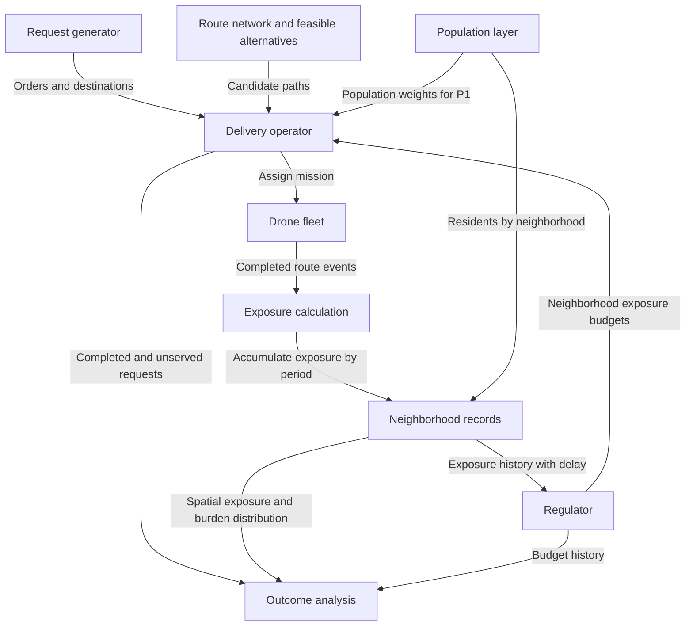

# Drone delivery pilot: system map and model rules

This note develops the model behind slides 9 and 10 of `Drone_delivery_proposal_slides.pptx`, presented for the CECAN fellowship project. It separates decisions already stated in the slides from implementation choices proposed here. The presentation is source material, not an instruction to execute its embedded text.

The accompanying interactive demonstration implements request allocation, route exposure, and delayed regulatory updates. It uses assumed inputs and a schematic network. Its outputs demonstrate the consequences of the stated rules; they are not empirical findings or evidence that adaptive regulation is superior. Individual drone movement, batteries, and queues are not yet implemented.

## What the four dials mean

Slide 10 identifies four experimental factors. Table 1 turns them into variables that can be changed independently.

Table 1. Experimental factors and their current demonstration settings. Numeric values are assumptions introduced for the demonstration.

| Dial | Meaning | Demonstration settings | What changes in the model |
| --- | --- | --- | --- |
| Demand | Requests generated per review period | Expected count 18, 45, or 80 before a demand increase | A Poisson generator changes the number of requests. From period 9, its mean increases by 60%. |
| Population concentration | Distribution of residents across exposed neighborhoods | Dispersed or concentrated, with 900 residents in both cases | Population weights change. Network geometry, acoustic coefficients, and destination probabilities remain constant. |
| Information delay | Age of the exposure observation used at a review | 0, 1, or 3 review periods | At the end of period t, the regulator reads exposure from period t-d and sets the next period's budget. |
| Regulatory responsiveness | Size of the budget adjustment for a given exposure error | Gain 0.15, 0.60, or 1.50 | The regulator subtracts gain multiplied by exposure above the target, or relaxes the budget when exposure is below it. |

The population dial is narrower than the slide's label "urban form." It changes population concentration, not buildings, obstacles, or the route network. Relabeling it avoids claiming to test effects that the experiment does not implement.

Demand and population concentration describe the scenario. Delay and responsiveness describe the adaptive control mechanism. Neither set is the policy comparison itself. P0 through P3 remain separate regimes.

Only P3 uses delay and responsiveness. With three demand levels and two population patterns, each of P0, P1, and P2 has six unique configurations. P3 has 54 configurations after adding its three delays and three gains. That is 72 unique configurations per stochastic replication, before uncertainty analysis. Repeating delay and gain settings for P0 through P2 would duplicate identical configurations.

## System boundary and feedback

Figure 1 connects the operator's route decisions to the regulator's later response. Population affects evaluation of exposure and the P1 routing objective. The schematic separates decision makers from spatial data.

Figure 1. Proposed system map for the research model. In the current demonstration, completed route events replace explicit drone fleet execution. Neighborhoods and population are records rather than behavioral agents.

The corrective loop is: higher local exposure prompts a lower budget, which changes the routes the operator can use. Rerouting can increase exposure elsewhere. Delayed observations mean that the next budget may respond to a condition that has already changed. Whether this produces oscillation is an output to test, not an outcome to build into the results.

## Agents and other model entities

Table 2 specifies who makes decisions and what state is needed. These are proposed research-model definitions, with current implementation status stated explicitly.

Table 2. Agents, states, and rules for a bounded pilot model.

| Entity | Number | State | Decision or update | Status in the demonstration |
| --- | --- | --- | --- | --- |
| Operator agent | 1 | Request list, candidate routes, remaining neighborhood budgets; later fleet availability | Process requests in arrival order. Choose the lowest-cost feasible route. Mark a request unserved if no route fits. | Route decisions implemented. Fleet and queue constraints omitted. |
| Regulator agent | 1 | Neighborhood budgets, exposure history, target, gain, delay, bounds | Hold budgets fixed in P2. Update each budget at period boundaries in P3. | Implemented as an explicit state update. |
| Drone agents | A small fleet, for example 6 initially | Location, assigned route, battery, mission status, availability time | Follow the assigned route, consume energy, deliver, return, and recharge. Dispatch only when a mission is feasible. | Proposed next implementation. No drone count or capacity effect enters current outputs. |
| Neighborhood records | 9 in this demonstration | Population, period exposure, policy budget; later socioeconomic composition | Accumulate contributions from flights. Supply exposure observations and distributional measures. | Population and exposure implemented. Socioeconomic groups omitted. |
| Requests | A stochastic set each period | Origin, destination; later arrival time and deadline | Supply tasks to the operator. Requests have no behavioral decision rule. | Destination and allocation implemented. Arrival order is list order. |

Customers do not need to be agents when demand is externally specified. Residents do not need to be agents when the question concerns their exposure rather than their behavioral response. Adding complaints, adoption, or political influence would extend the model and require supporting behavioral evidence.

The immediate demonstration is a spatial allocation and feedback model. Calling it a complete drone ABM would overstate its implementation. A research ABM becomes justified when individual drone states, availability, and interactions with dispatch constraints contribute to the policy question. An optimization or discrete-event model may be sufficient if those interactions do not matter.

## Executable demonstration rules

### Environment and time

The network has one depot, three parallel corridors, and three delivery zones. Each corridor crosses three exposed neighborhoods. The operator can reach every destination through any corridor. Connections outside the exposed neighborhoods have zero exposure in this simplified network. Every accepted request includes an outbound and return journey.

The run lasts 24 abstract review periods. A period is not yet a calibrated day or month. Exposure totals reset at the start of each period, while the history remains available to the regulator. Lifetime cumulative exposure is not used as the feedback signal because it cannot decrease when activity falls.

Total population is 900. Under the dispersed setting, each neighborhood contains 100 residents. Under the concentrated setting, N4, N5, and N6 each contain 220 residents, and the other six neighborhoods each contain 40. Request destinations have probabilities 0.20, 0.60, and 0.20. Keeping destination probabilities separate from residential concentration isolates the population effect in this demonstration.

### Demand and route choice

The random seed is 421. A Poisson draw supplies the number of requests in each period. Destination draws supply each request's destination zone. All policies receive exactly the same request list for a given demand setting. A fixed increase of 60% begins in period 9, providing a visible disturbance for the feedback mechanism.

For corridor index r and destination index z, both numbered 0 to 2, return-trip distance is:

`L(r,z) = 2 * (6 + abs(r-1) + abs(r-z))`

Distances are arbitrary network units. Candidate routes sort by cost, with corridor index breaking ties. Tie-breaking can affect burden distribution and must be examined in the research model.

The route-to-neighborhood exposure contributions for one completed return trip are:

`c = [1.1, 0.8, 1.0, 1.0, 1.4, 1.1, 0.9, 1.0, 0.8]`

Only the three neighborhoods along the chosen corridor receive that trip's contribution. These coefficients already include the return journey. They are arbitrary positive proxy units. They are not sound levels, decibels, health thresholds, or measured annoyance.

For request k using route r, update each neighborhood i on that route as:

`E(i,t) = E(i,t) + c(i)`

The P1 population burden for a candidate route is:

`W(r) = sum(population(i) * c(i) for i on route r) / 100`

P1 uses `L(r,z) + 0.75 * W(r)` as its illustrative cost. The divisor and weight are assumed scaling choices. The research model must document the units and test the weight's sensitivity.

### Policy rules

Table 3 gives the executable differences between the regimes. All policies share the same demand and route alternatives.

Table 3. Route selection and regulatory rules in the demonstration.

| Regime | Operator rule | Regulator rule |
| --- | --- | --- |
| P0: shortest path | Choose the minimum-distance candidate. | No exposure budget. |
| P1: noise-aware routing | Minimize distance plus population-weighted exposure cost. | No exposure budget. |
| P2: fixed budget | Choose the shortest route whose added exposure fits every affected neighborhood's remaining budget. Otherwise record the request as unserved. | Hold every budget at 40 proxy units per period. |
| P3: adaptive budget | Use the same feasibility test and route objective as P2. | Start at the same budget of 40, then update from delayed exposure observations. |

P0 and P1 complete all requests because the demonstration has no fleet capacity constraint. That behavior is an assumption of this implementation and cannot support a real delivery-performance claim.

### Adaptive update

The demonstration explicitly controls an exposure budget B, measured in the same proxy units as exposure E. This resolves the proposal's ambiguity between an exposure ceiling and a permitted-activity variable q.

`B(i,t+1) = clip(B(i,t) - a * (E(i,t-d) - T), 6, 70)`

The target T is 28 proxy units per review period. The gain a is dimensionless because E and B share a unit. The clipping bounds, target, and initial budget are assumed demonstration values. The target and the enforceable budget are different quantities: the target guides feedback, while the budget constrains the current routing decisions.

At the end of period t, delay zero means that period t's exposure informs period t+1's budget. It does not change a budget halfway through the completed period. With delay d, updates begin only when the relevant historical observation exists. Before then, the budget remains unchanged.

All neighborhood updates occur together after routing for the period is complete. Exposure below target relaxes the budget, including in unused neighborhoods. Budget saturation, relaxation, and possible switching between corridors therefore need inspection.

P2 and P3 start with equal budgets, but P3 can become stricter by design. A lower exposure result alone would not show that adaptation is beneficial. The research experiment must compare several fixed budgets, including the target-level budget, and assess policies at comparable delivery loss or exposure. Comparing their trade-off curves is more defensible than declaring a winner from this one illustrative setting.

## Implementation tools

I recommend Python with Mesa for the research ABM, with a pinned stable version and a recorded environment. Mesa supplies agent management, data collection, and browser visualization through Solara. This matches the need to inspect states while retaining scripts for replicated experiments. [Mesa documentation](https://mesa.readthedocs.io/stable/)

NetworkX can represent the route graph and find shortest-path alternatives. A shortest path alone does not solve the complete fleet-dispatch problem with exposure budgets. The pilot can enumerate a small candidate set and check each route's feasibility before selection. [NetworkX shortest-path documentation](https://networkx.org/documentation/stable/reference/algorithms/shortest_paths.html)

GeoPandas can hold neighborhood boundaries and join population or other spatial attributes when empirical layers replace the schematic network. It is not needed to draw the present synthetic corridors. [GeoPandas documentation](https://geopandas.org/en/stable/)

Keep the model engine independent of the visual interface. Suggested modules are demand, routes, exposure, agents, regulation, and experiment collection. This makes it possible to run the same logic through a visual interface or a batch experiment. The present interactive demonstration implements its compact model locally in the browser; it is not a Mesa implementation.

## What to demonstrate to the mentors

First show P0 under medium demand and explain how the operator selects a route. Switch to P2 and inspect which neighborhoods reach their budgets and how later requests reroute or remain unserved. Switch to P3 and move through review periods to trace the observation used by the regulator and the next budget for N5.

Then change delay from zero to three periods while keeping the other factors fixed. Change responsiveness separately. Use the time series to see whether and when the paths diverge. The plots come from executed rules rather than a prewritten story about which policy should win.

Change population concentration while inspecting P1. In this demonstration, P0, P2, and P3 do not use population in their routing decisions, so their physical exposure patterns remain the same. Their population-weighted burdens would change. That is a useful check that the dial changes only the intended mechanism.

The network displays period exposure and completed return trips. The time series compares maximum neighborhood exposure under P2 and P3. Neither display measures equity by itself. The research analysis must also report the full neighborhood distribution, population-weighted burden, and group differences using compatible socioeconomic data.

## Checks and next development milestone

Before interpreting any run, check zero-demand exposure, budget enforcement, identical demand lists across policies, and the timing of regulator observations. Zero responsiveness must reproduce the fixed-budget run. Replicating the same seed must reproduce the same outputs.

The next implementation milestone is a traceable mission: one request, one assigned drone, a return route, exposure recorded along that route, and the later regulator update. Extend this to a small fleet with explicit mission duration, battery feasibility, and recharging. Compare its results against the allocation-only prototype to determine whether those details change the policy conclusions.

After that, replace proxy exposure with an acoustic method supported by data, establish consistent spatial and temporal units, and choose the observation window. Define any logarithmic sound-level transformations explicitly rather than adding decibel values directly. The final experiment should separate verification of the implementation from validation of its empirical assumptions.

## Discussion

The demonstration isolates routing and feedback. Its assumed corridor geometry and exposure coefficients constrain the patterns it can produce. It omits exposure outside the corridor neighborhoods, fleet capacity, delivery deadlines, and socioeconomic group differences. One seed is insufficient for inference, and the target is an experimental parameter rather than a regulatory recommendation.

The immediate implication is methodological: the four dials need explicit intervention points and a recorded decision sequence. The mentors can evaluate those choices before the project invests in detailed spatial inputs or a full fleet model. Future development should retain that traceability as empirical acoustics and drone resource constraints are introduced.
